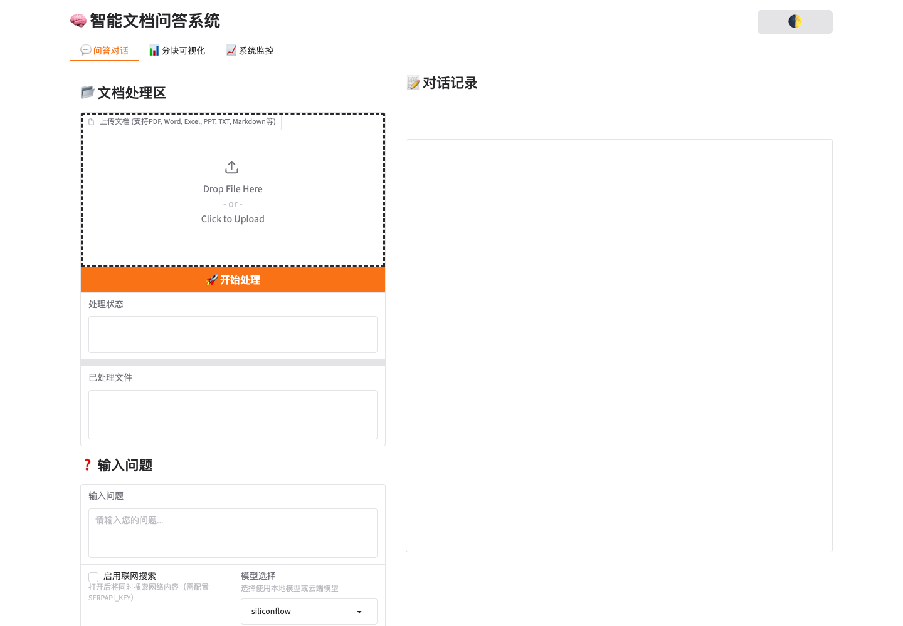
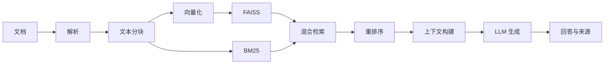

<div align="center">

# Local PDF Chat RAG

一个透明、可运行的 Python RAG 学习与参考实现

[English](README_EN.md) | 简体中文

[](https://github.com/weiwill88/Local_Pdf_Chat_RAG/actions/workflows/ci.yml)
[](LICENSE)
[](https://www.python.org/)
[](https://github.com/weiwill88/Local_Pdf_Chat_RAG/releases)
[](https://github.com/weiwill88/Local_Pdf_Chat_RAG/stargazers)

</div>

Local PDF Chat RAG 面向希望理解检索增强生成完整链路的开发者。项目把文档解析、文本分块、向量化、FAISS、BM25、混合检索、重排序和回答生成拆成可以单独阅读、测试和替换的模块，并提供 Gradio 界面和 FastAPI 接口。

> 本仓库是教学与实验用途的参考实现，不是开箱即用的生产级知识库服务。用于真实业务前，请补充身份鉴权、租户隔离、持久化、评测、安全审计和部署治理。



## 项目特点

- **链路透明**：核心步骤按 RAG 执行顺序拆分，便于学习和调试。
- **混合检索**：结合 FAISS 向量检索和 BM25 关键词检索。
- **可选重排序**：支持 CrossEncoder 或基于模型的相关性评分。
- **多模型后端**：支持本地 Ollama、SiliconFlow 以及 OpenAI-compatible API。
- **多种文档格式**：支持 PDF、TXT、Markdown、DOCX、XLS/XLSX 和 PPTX。
- **双入口**：提供 Gradio Web UI 和 FastAPI REST API。
- **可验证维护**：包含自动化测试、GitHub Actions CI、贡献指南和安全报告流程。

## RAG 流程



## 快速开始

### 1. 创建环境

```bash
git clone https://github.com/weiwill88/Local_Pdf_Chat_RAG.git
cd Local_Pdf_Chat_RAG

python3.10 -m venv .venv
source .venv/bin/activate  # Windows: .venv\Scripts\activate
python -m pip install --upgrade pip
pip install -r requirements.txt
```

### 2. 配置一个模型后端

```bash
cp example.env .env
```

编辑 `.env`，至少完成下面一种配置：

- 设置 `SILICONFLOW_API_KEY`；
- 设置 `MAGICK_API_KEY`、服务地址和模型名称；
- 本地启动 Ollama，并拉取 `.env` 中配置的模型。

密钥只保存在本地 `.env` 中。请勿提交真实密钥；示例配置中的 `Your_...` 占位符不会被识别为有效密钥。

### 3. 启动 Web UI

```bash
python rag_demo.py
```

应用默认尝试 `http://127.0.0.1:17995`，端口被占用时会依次尝试 17996–17999。

### 4. 启动 REST API

```bash
python api_router.py
```

主要接口：

- `GET /api/status`：运行状态与后端配置状态；
- `POST /api/upload`：上传并处理文档；
- `POST /api/ask`：基于已处理文档提问。

## 项目结构

```text
├── config.py                  # 环境变量、模型与 RAG 参数
├── rag_demo.py                # Gradio Web UI
├── api_router.py              # FastAPI 接口
├── core/
│   ├── document_loader.py     # 文档解析
│   ├── text_splitter.py       # 文本分块
│   ├── embeddings.py          # 向量化
│   ├── vector_store.py        # FAISS 索引
│   ├── bm25_index.py          # BM25 索引
│   ├── retriever.py           # 混合与递归检索
│   ├── reranker.py            # 结果重排序
│   └── generator.py           # 上下文和回答生成
├── features/                  # 联网搜索、冲突检测等扩展能力
├── tests/                     # 无外部密钥的自动化测试
└── .github/                   # CI、Issue 与 PR 模板
```

## 测试

```bash
pip install -r requirements-dev.txt
PYTEST_DISABLE_PLUGIN_AUTOLOAD=1 python -m pytest
```

当前测试覆盖：

- 配置和默认后端选择；
- TXT、Markdown 和不支持格式的文档加载行为；
- BM25 与混合检索合并；
- 未配置 API Key 时不发起外部请求并返回明确错误。

所有 Pull Request 都会通过 GitHub Actions 执行源码编译和测试。

## 配置说明

完整示例见 [`example.env`](example.env)。常用变量包括：

| 变量 | 作用 |
| --- | --- |
| `SILICONFLOW_API_KEY` | SiliconFlow API 密钥 |
| `SILICONFLOW_MODEL_NAME` | SiliconFlow 模型 ID |
| `MAGICK_API_KEY` | OpenAI-compatible 服务密钥 |
| `MAGICK_API_URL` | 服务 base URL 或完整 Chat Completions URL |
| `MAGICK_MODEL_NAME` | 服务端模型 ID |
| `OLLAMA_MODEL_NAME` | 本地 Ollama 模型名称 |
| `SERPAPI_KEY` | 可选联网搜索密钥 |
| `RERANK_METHOD` | `cross_encoder` 或 `llm` |

## 已知边界

- PDF 采用文本层提取，不包含通用 OCR；扫描件需要先做 OCR。
- Excel 与 PPT 的解析以文本提取为主，不保留完整视觉布局。
- 索引当前保存在进程内存中，服务重启后需要重新处理文档。
- 首次使用向量或重排序模型时可能需要下载模型文件。
- 联网搜索和云端模型会把相应查询发送到第三方服务，请先确认数据边界。

## 参与贡献

欢迎提交可复现的 Bug、文档改进和聚焦的功能 Pull Request。开始前请阅读 [`CONTRIBUTING.md`](CONTRIBUTING.md) 和 [`CODE_OF_CONDUCT.md`](CODE_OF_CONDUCT.md)。

安全问题请不要创建公开 Issue，具体流程见 [`SECURITY.md`](SECURITY.md)。

## 版本与维护

- 变更记录：[`CHANGELOG.md`](CHANGELOG.md)
- 已发布版本：[GitHub Releases](https://github.com/weiwill88/Local_Pdf_Chat_RAG/releases)
- 当前维护者：[Will Wei](https://github.com/weiwill88)

## 许可证

本项目采用 [MIT License](LICENSE)。
