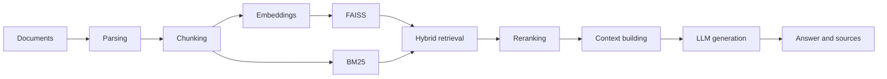

<div align="center">

# Local PDF Chat RAG

A transparent, runnable Python implementation for learning and inspecting RAG

English | [简体中文](README.md)

[](https://github.com/weiwill88/Local_Pdf_Chat_RAG/actions/workflows/ci.yml)
[](LICENSE)
[](https://www.python.org/)
[](https://github.com/weiwill88/Local_Pdf_Chat_RAG/releases)
[](https://github.com/weiwill88/Local_Pdf_Chat_RAG/stargazers)

</div>

Local PDF Chat RAG is an educational and reference implementation for developers who want to inspect the complete retrieval-augmented generation pipeline. Document loading, chunking, embeddings, FAISS, BM25, hybrid retrieval, reranking, and answer generation are split into readable and replaceable modules. The repository includes both a Gradio UI and a FastAPI interface.

> This repository is intended for learning and experimentation. It is not a production-ready knowledge-base service. Add authentication, tenant isolation, persistence, evaluation, security controls, and deployment governance before using it with real business data.


## Why this project

- **Inspectable pipeline**: core modules follow the order in which a RAG request is processed.
- **Hybrid retrieval**: combines FAISS dense retrieval with BM25 keyword retrieval.
- **Optional reranking**: supports a CrossEncoder or model-based relevance scoring.
- **Multiple model backends**: local Ollama, SiliconFlow, and OpenAI-compatible APIs.
- **Document support**: PDF, TXT, Markdown, DOCX, XLS/XLSX, and PPTX.
- **Two interfaces**: a Gradio web application and a FastAPI REST API.
- **Verifiable maintenance**: automated tests, GitHub Actions CI, contribution guidance, and a security-reporting process.

## RAG pipeline



## Quick start

### 1. Create an environment

```bash
git clone https://github.com/weiwill88/Local_Pdf_Chat_RAG.git
cd Local_Pdf_Chat_RAG

python3.10 -m venv .venv
source .venv/bin/activate  # Windows: .venv\Scripts\activate
python -m pip install --upgrade pip
pip install -r requirements.txt
```

### 2. Configure one model backend

```bash
cp example.env .env
```

Edit `.env` and choose at least one option:

- set `SILICONFLOW_API_KEY`;
- set `MAGICK_API_KEY`, its endpoint, and model name; or
- start Ollama locally and pull the model configured in `.env`.

Keep real credentials in your local `.env` file. Values beginning with `Your_` are treated as placeholders and are not valid credentials.

### 3. Start the web UI

```bash
python rag_demo.py
```

The application first tries `http://127.0.0.1:17995`, then ports 17996–17999 if needed.

### 4. Start the REST API

```bash
python api_router.py
```

Main endpoints:

- `GET /api/status`: runtime and provider configuration status;
- `POST /api/upload`: upload and process a document;
- `POST /api/ask`: ask a question against processed documents.

## Repository layout

```text
├── config.py                  # Environment, model, and RAG settings
├── rag_demo.py                # Gradio web UI
├── api_router.py              # FastAPI interface
├── core/
│   ├── document_loader.py     # Document extraction
│   ├── text_splitter.py       # Text chunking
│   ├── embeddings.py          # Embeddings
│   ├── vector_store.py        # FAISS index
│   ├── bm25_index.py          # BM25 index
│   ├── retriever.py           # Hybrid and recursive retrieval
│   ├── reranker.py            # Result reranking
│   └── generator.py           # Context and answer generation
├── features/                  # Web search and optional extensions
├── tests/                     # Tests that require no external credentials
└── .github/                   # CI, issue forms, and pull request template
```

## Tests

```bash
pip install -r requirements-dev.txt
PYTEST_DISABLE_PLUGIN_AUTOLOAD=1 python -m pytest
```

The current suite covers:

- configuration and default backend selection;
- TXT, Markdown, and unsupported-file loading behavior;
- BM25 and hybrid-result merging;
- clean, network-free failure when an API key is missing.

GitHub Actions compiles the Python sources and runs the test suite for every pull request.

## Configuration

See [`example.env`](example.env) for the complete example. Common variables include:

| Variable | Purpose |
| --- | --- |
| `SILICONFLOW_API_KEY` | SiliconFlow API credential |
| `SILICONFLOW_MODEL_NAME` | SiliconFlow model ID |
| `MAGICK_API_KEY` | OpenAI-compatible provider credential |
| `MAGICK_API_URL` | Provider base URL or full Chat Completions URL |
| `MAGICK_MODEL_NAME` | Provider model ID |
| `OLLAMA_MODEL_NAME` | Local Ollama model name |
| `SERPAPI_KEY` | Optional web-search credential |
| `RERANK_METHOD` | `cross_encoder` or `llm` |

## Known limitations

- PDF extraction reads the text layer and does not provide general-purpose OCR.
- Excel and PowerPoint extraction focuses on text rather than visual layout.
- The index is currently in process memory and must be rebuilt after restart.
- Embedding and reranking models may be downloaded on first use.
- Cloud model and web-search requests send the relevant query to third-party services; review your data boundary first.

## Contributing

Reproducible bug reports, documentation improvements, and focused pull requests are welcome. Read [`CONTRIBUTING.md`](CONTRIBUTING.md) and [`CODE_OF_CONDUCT.md`](CODE_OF_CONDUCT.md) before contributing.

Do not open a public issue for a vulnerability. Follow [`SECURITY.md`](SECURITY.md) instead.

## Releases and maintenance

- Changelog: [`CHANGELOG.md`](CHANGELOG.md)
- Releases: [GitHub Releases](https://github.com/weiwill88/Local_Pdf_Chat_RAG/releases)
- Maintainer: [Will Wei](https://github.com/weiwill88)

## License

Released under the [MIT License](LICENSE).
