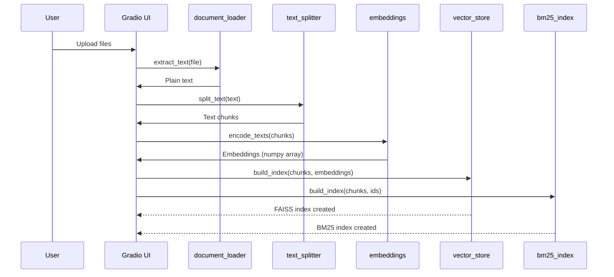
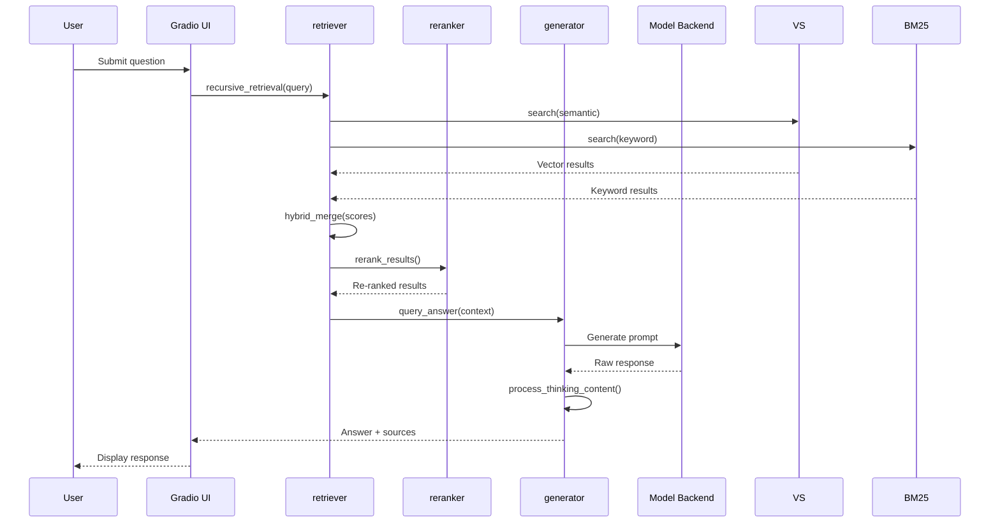
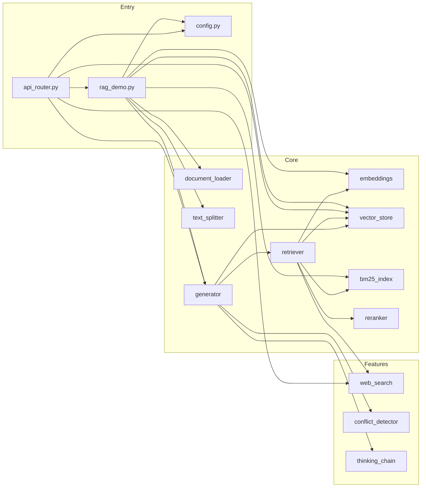

# Architecture Overview

This document describes the system architecture, component responsibilities, and data flow relationships in the Local PDF Chat RAG system.

## System Architecture

<!-- openwiki: mermaid parse failed and this diagram was converted to a text fence so it does not break rendering. Fix the diagram source and restore the mermaid fence. Parser error: Heuristic: an unescaped angle bracket inside a label breaks rendering; rephrase the label. -->
```text
flowchart TB
    subgraph Interfaces
        UI[Gradio Web UI<br/>rag_demo.py]
        API[FastAPI REST API<br/>api_router.py]
    end

    subgraph Configuration
        CFG[config.py<br/>Environment & Models]
    end

    subgraph Core RAG Pipeline
        DL[Document Loader<br/>document_loader.py]
        TS[Text Splitter<br/>text_splitter.py]
        EMB[Embeddings<br/>embeddings.py]
        VS[Vector Store<br/>vector_store.py]
        BM25[BM25 Index<br/>bm25_index.py]
        RET[Retriever<br/>retriever.py]
        RER[Reranker<br/>reranker.py]
        GEN[Generator<br/>generator.py]
    end

    subgraph Features
        WS[Web Search<br/>web_search.py]
        CD[Conflict Detector<br/>conflict_detector.py]
        TC[Thinking Chain<br/>thinking_chain.py]
    end

    subgraph Utilities
        NET[Network Utils<br/>network.py]
    end

    UI --> CFG
    API --> CFG
    UI --> DL
    API --> DL
    DL --> TS
    TS --> EMB
    EMB --> VS
    EMB --> BM25
    VS --> RET
    BM25 --> RET
    RET --> RER
    RER --> GEN
    GEN --> UI
    GEN --> API
    WS --> RET
    CD --> GEN
    TC --> GEN
    NET --> GEN
    NET --> API
```

## Component Responsibilities

### Entry Points

| Component | File | Responsibility |
|-----------|------|----------------|
| Gradio UI | `rag_demo.py` | Web interface with three tabs: Q&A, chunk visualization, system monitoring |
| REST API | `api_router.py` | FastAPI endpoints for upload, query, and status |
| Configuration | `config.py` | Environment loading, model selection, RAG hyperparameters |

### Core RAG Modules

| Module | File | Responsibility |
|--------|------|----------------|
| Document Loader | `core/document_loader.py` | Extract text from PDF, DOCX, XLSX, PPTX, TXT, MD |
| Text Splitter | `core/text_splitter.py` | Chunk text using RecursiveCharacterTextSplitter |
| Embeddings | `core/embeddings.py` | Convert text to vectors using sentence-transformers |
| Vector Store | `core/vector_store.py` | FAISS index management with auto-selection |
| BM25 Index | `core/bm25_index.py` | Sparse keyword retrieval with jieba tokenization |
| Retriever | `core/retriever.py` | Hybrid search + recursive retrieval with LLM query optimization |
| Reranker | `core/reranker.py` | Two-stage reranking (CrossEncoder or LLM) |
| Generator | `core/generator.py` | Prompt engineering and LLM response generation |

### Feature Modules

| Module | File | Responsibility |
|--------|------|----------------|
| Web Search | `features/web_search.py` | SerpAPI integration for real-time web information |
| Conflict Detector | `features/conflict_detector.py` | Detect contradictions across multiple sources |
| Thinking Chain | `features/thinking_chain.py` | Format DeepSeek-R1 <think> tags as collapsible HTML |

### Utilities

| Module | File | Responsibility |
|--------|------|----------------|
| Network | `utils/network.py` | HTTP session with retry logic, port availability checking |

## Data Flow

### Document Processing Flow



### Query Processing Flow



## Lifecycle and State Management

### In-Memory State

The system maintains **in-memory state only**:

- **vector_store**: FAISS index, chunk contents, metadata mappings
- **bm25_manager**: BM25 index, tokenized corpus
- **chunk_data_cache**: Gradio UI chunk visualization cache

### State Clearing Behavior

State is cleared when:
1. New documents are uploaded (`process_multiple_files()` calls `vector_store.clear()` and `bm25_manager.clear()`)
2. Application restarts (no persistence)

```python
# rag_demo.py lines 54-56
progress(0.1, desc="清理历史数据...")
vector_store.clear()
bm25_manager.clear()
```

### No Persistence

> **Important**: The system does not persist indexes to disk. After restart, documents must be reprocessed.

## Error Handling Patterns

### Fallback Mechanisms

| Component | Failure Case | Fallback Behavior |
|-----------|--------------|-------------------|
| CrossEncoder | Model load fails | Return results in original order (reranker.py line 46-48) |
| LLM Rerank | API error | Return 5.0 relevance score (reranker.py line 88-90) |
| API Key Missing | No configured key | Return error message without external request (generator.py line 59-64) |
| Document Format | Unsupported extension | Return empty string (document_loader.py line 76-78) |
| Import Errors | Missing optional deps | Log error, return empty string (document_loader.py lines 44-74) |

### Retry Configuration

HTTP requests use retry logic via `get_session()`:

```python
# utils/network.py lines 13-24
retry = Retry(
    total=3,
    backoff_factor=0.1,
    status_forcelist=[500, 502, 503, 504]
)
```

## Dependencies and Relationships

### Import Graph



### Key Symbols by Module

| Module | Primary Export | Purpose |
|--------|----------------|---------|
| `config.py` | `detect_default_model()`, `is_configured_api_key()` | Model selection logic |
| `core/document_loader.py` | `extract_text()` | Multi-format text extraction |
| `core/text_splitter.py` | `split_text()` | Text chunking |
| `core/embeddings.py` | `encode_texts()`, `encode_query()` | Text to vector conversion |
| `core/vector_store.py` | `VectorStore`, `vector_store` (singleton) | FAISS index management |
| `core/bm25_index.py` | `BM25IndexManager`, `bm25_manager` (singleton) | BM25 index management |
| `core/retriever.py` | `hybrid_merge()`, `recursive_retrieval()` | Hybrid + recursive retrieval |
| `core/reranker.py` | `rerank_results()`, `get_cross_encoder()` | Result reranking |
| `core/generator.py` | `query_answer()`, `call_cloud_api()` | LLM response generation |
| `features/web_search.py` | `search_web()`, `check_serpapi_key()` | Web search integration |
| `features/conflict_detector.py` | `detect_conflicts()`, `evaluate_source_credibility()` | Conflict detection |
| `features/thinking_chain.py` | `process_thinking_content()` | Thinking content formatting |
| `utils/network.py` | `get_session()`, `is_port_available()` | Network utilities |

## Version Information

- **Current Version**: 2.1.0 (from [`version.py`](/version.py))
- **Python Requirement**: 3.10+
- **Primary Dependencies**: See [`requirements.txt`](/requirements.txt)
