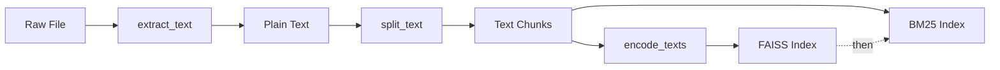

# Document Processing

This document covers the document loading and text splitting components of the RAG pipeline.

## Document Loader

### Overview

The document loader (`core/document_loader.py`) extracts plain text from multiple file formats:

| Format | Extension | Library | Notes |
|--------|-----------|---------|-------|
| PDF | `.pdf` | `pdfminer.six` | Text layer extraction only, no OCR |
| Word | `.docx` | `python-docx` | Paragraph text extraction |
| Excel | `.xlsx`, `.xls` | `pandas` | Sheet-by-sheet extraction |
| PowerPoint | `.pptx` | `python-pptx` | Shape text extraction |
| Plain Text | `.txt` | Built-in | UTF-8 encoding |
| Markdown | `.md` | Built-in | UTF-8 encoding |

### Primary Symbol: `extract_text()`

**Location**: `core/document_loader.py` line 14

**Signature**:
```python
def extract_text(filepath: str) -> str:
    """
    Extract plain text from file.

    Args:
        filepath: Path to document file

    Returns:
        Extracted text content, or empty string if unsupported/failed
    """
```

**Implementation Details**:

1. **PDF Processing** (lines 28-33):
   - Uses `pdfminer.high_level.extract_text_to_fp`
   - Outputs to StringIO buffer
   - Returns extracted text

2. **TXT/MD Processing** (lines 35-37):
   - Simple UTF-8 file read
   - No special parsing

3. **DOCX Processing** (lines 39-46):
   - Uses `docx.Document`
   - Extracts paragraph text with `"\n".join([para.text for para in doc.paragraphs])`
   - Returns empty string if `python-docx` not installed

4. **Excel Processing** (lines 48-60):
   - Uses `pandas.ExcelFile`
   - Iterates through sheet names
   - Formats as "工作表：{sheet_name}\n{df.to_string()}"
   - Returns empty string if `pandas` not installed

5. **PPTX Processing** (lines 62-74):
   - Uses `pptx.Presentation`
   - Extracts text from shapes with `shape.text`
   - Returns empty string if `python-pptx` not installed

6. **Unsupported Formats** (lines 76-78):
   - Logs warning
   - Returns empty string

### Error Handling

```python
# Import errors handled per-format
except ImportError:
    logging.error("处理 Word 文档需要安装 python-docx 库")
    return ""
```

### Focused Tests

**File**: `tests/test_document_loader.py`

**Test Cases**:
- `test_extract_utf8_text_and_markdown` - Verifies UTF-8 TXT and Markdown extraction
- `test_unsupported_extension_returns_empty_string` - Verifies unsupported formats return ""

## Text Splitter

### Overview

The text splitter (`core/text_splitter.py`) chunks long text into retrieval-friendly fragments using LangChain's `RecursiveCharacterTextSplitter`.

### Configuration Parameters

| Parameter | Default | Location | Purpose |
|-----------|---------|----------|---------|
| CHUNK_SIZE | 400 | `config.py` line 80 | Maximum characters per chunk |
| CHUNK_OVERLAP | 40 | `config.py` line 81 | Overlap between adjacent chunks |

### Primary Symbol: `split_text()`

**Location**: `core/text_splitter.py` line 14

**Signature**:
```python
def split_text(
    text: str,
    chunk_size: int = None,
    chunk_overlap: int = None
) -> List[str]:
    """
    Split long text into multiple fragments.

    Uses RecursiveCharacterTextSplitter to recursively split:
    First by paragraphs, then by sentences, etc.

    Args:
        text: Long text to split
        chunk_size: Max characters per chunk (default: 400)
        chunk_overlap: Overlap between chunks (default: 40)

    Returns:
        List of text fragments
    """
```

### Splitting Strategy

**Separators** (line 32):
```python
separators=["\n\n", "\n", "。", "，", "；", "：", " ", ""]
```

The splitter tries each separator in order:
1. Double newline (paragraphs)
2. Single newline (lines)
3. Chinese period (。)
4. Chinese comma (，)
5. Chinese semicolon (；)
6. Chinese colon (：)
7. Space
8. Empty string (character-level)

### Implementation

```python
# core/text_splitter.py lines 29-33
text_splitter = RecursiveCharacterTextSplitter(
    chunk_size=chunk_size or CHUNK_SIZE,
    chunk_overlap=chunk_overlap or CHUNK_OVERLAP,
    separators=["\n\n", "\n", "。", "，", "；", "：", " ", ""]
)
return text_splitter.split_text(text)
```

### Design Rationale

- **Chunk Size (400)**: Balances retrieval granularity with context preservation
- **Overlap (40)**: Prevents key information from being cut at boundaries
- **Chinese Separators**: Includes Chinese punctuation for better Chinese text handling

### Usage Example

```python
from core.text_splitter import split_text

text = """这是一个很长的文本。
它包含多个段落和句子。
分块器会智能地切割它。"""

chunks = split_text(text)
# Returns: ["这是一个很长的文本。\n它包含多个段落和句子。", "..."]
```

## Data Flow Integration

### Document Processing Pipeline



**Sequential Order**: FAISS indexing completes first, then BM25 indexing is invoked.

```python
# rag_demo.py lines 86-93
progress(0.8, desc="生成文本嵌入...")
embeddings = encode_texts(all_chunks, show_progress=True)

progress(0.9, desc="构建 FAISS 索引...")
vector_store.build_index(all_chunks, all_ids, all_metadatas, embeddings)

progress(0.95, desc="构建 BM25 检索索引...")
bm25_manager.build_index(all_chunks, all_ids)
```

**BM25IndexManager.build_index Invocation**: Called after `vector_store.build_index` completes, using the same chunks and chunk_ids.

### Chunk Metadata Structure

Each chunk is associated with metadata:

```python
# rag_demo.py lines 72-74
doc_id = f"doc_{int(time.time())}_{idx}"
metadatas = [{"source": file_name, "doc_id": doc_id} for _ in chunks]
chunk_ids = [f"{doc_id}_chunk_{i}" for i in range(len(chunks))]
```

**Metadata Fields**:
- `source`: Original filename
- `doc_id`: Document identifier (timestamp + index)
- Chunk ID format: `{doc_id}_chunk_{i}`

## Change Recipes

### Adding a New Document Format

1. Add format check in `extract_text()` (document_loader.py line 26)
2. Import required library
3. Implement text extraction logic
4. Handle ImportError gracefully
5. Add test in `tests/test_document_loader.py`

**Example**:
```python
elif file_ext == '.epub':
    try:
        from ebooklib import epub
        book = epub.read_epub(filepath)
        text = ""
        for item in book.get_items():
            if item.get_type() == ITEM_DOCUMENT:
                text += item.get_content().decode('utf-8')
        return text
    except ImportError:
        logging.error("处理 EPUB 需要安装 ebooklib 库")
        return ""
```

### Adjusting Chunk Size

1. Modify `CHUNK_SIZE` in `config.py` (line 80)
2. Consider impact on retrieval granularity
3. Test with representative documents
4. Update documentation if deviating from default

### Changing Separators

1. Modify `separators` list in `split_text()` (text_splitter.py line 32)
2. Order matters - more specific separators first
3. Test with target language documents

## Related Components

<!-- openwiki: broken internal link [/core/embeddings-and-vector-store.md] file "/core/embeddings-and-vector-store.md" does not exist. Fix the href or restore the target, then delete this comment. -->
- [Embeddings and Vector Store](/core/embeddings-and-vector-store.md) - How chunks are converted to vectors
<!-- openwiki: broken internal link [/core/retrieval-and-reranking.md] file "/core/retrieval-and-reranking.md" does not exist. Fix the href or restore the target, then delete this comment. -->
- [Retrieval and Reranking](/core/retrieval-and-reranking.md) - How chunks are retrieved
<!-- openwiki: broken internal link [/configuration/environment-and-models.md] file "/configuration/environment-and-models.md" does not exist. Fix the href or restore the target, then delete this comment. -->
- [Configuration](/configuration/environment-and-models.md) - Chunk size and overlap configuration
