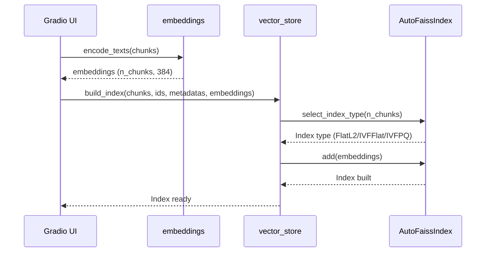

# Embeddings and Vector Store

This document covers text embedding generation and FAISS vector index management for dense semantic retrieval.

## Embedding Models

### Overview

The embeddings module (`core/embeddings.py`) converts text into fixed-dimensional vectors using sentence transformers. Similar semantics are represented as closer vectors in the embedding space.

### Model Configuration

**Default Model**: `all-MiniLM-L6-v2` (line 18)

| Model | Dimension | Language | Notes |
|-------|-----------|----------|-------|
| `all-MiniLM-L6-v2` | 384 | English-optimized | Default, lightweight, fast |
| `shibing624/text2vec-base-chinese` | 768 | Chinese-optimized | Alternative for Chinese |
| `BAAI/bge-small-zh-v1.5` | 768 | Chinese-optimized | Better Chinese performance |

### Primary Symbols

#### `get_embed_model()`

**Location**: `core/embeddings.py` line 22

**Signature**:
```python
@lru_cache(maxsize=1)
def get_embed_model() -> SentenceTransformer:
    """
    Get embedding model (singleton + cached).

    Returns:
        SentenceTransformer instance
    """
```

**Implementation Details**:
- Uses `lru_cache` for singleton pattern
- Loads model on first call
- Returns cached instance on subsequent calls
- Model downloads automatically on first run (~80MB)

```python
# core/embeddings.py lines 28-32
from sentence_transformers import SentenceTransformer
logging.info(f"加载向量化模型：{EMBED_MODEL_NAME}")
model = SentenceTransformer(EMBED_MODEL_NAME)
logging.info(f"向量化模型加载完成，输出维度：{model.get_sentence_embedding_dimension()}")
return model
```

#### `encode_texts()`

**Location**: `core/embeddings.py` line 35

**Signature**:
```python
def encode_texts(
    texts: List[str],
    show_progress: bool = False
) -> np.ndarray:
    """
    Encode text list into vectors.

    Args:
        texts: List of texts to encode
        show_progress: Whether to show progress bar

    Returns:
        numpy array of shape (n_texts, embedding_dim), dtype float32
    """
```

**Usage**:
```python
embeddings = encode_texts(chunks, show_progress=True)
# Returns: numpy array of shape (n_chunks, 384)
```

#### `encode_query()`

**Location**: `core/embeddings.py` line 51

**Signature**:
```python
def encode_query(query: str) -> np.ndarray:
    """
    Encode single query text.

    Returns:
        numpy array of shape (1, embedding_dim), dtype float32
    """
```

**Usage**:
```python
query_embedding = encode_query("What is RAG?")
# Returns: numpy array of shape (1, 384)
```

## FAISS Vector Store

### Overview

The vector store module (`core/vector_store.py`) manages FAISS (Facebook AI Similarity Search) indexes for efficient vector similarity search.

### AutoFaissIndex Class

**Location**: `core/vector_store.py` line 17

The `AutoFaissIndex` class automatically selects the optimal FAISS index type based on dataset size.

#### Index Type Selection

| Dataset Size | Index Type | Algorithm | Use Case |
|--------------|------------|-----------|----------|
| < 10,000 | `FlatL2` | Exact search | Small datasets, high precision |
| 10,000 - 100,000 | `IVFFlat` | Inverted file + exact | Medium datasets, balanced |
| > 100,000 | `IVFPQ` | Inverted file + product quantization | Large datasets, efficiency |

#### Selection Logic

```python
# core/vector_store.py lines 41-62
def select_index_type(self, num_vectors):
    if num_vectors <= self.small_dataset_threshold:  # < 10k
        self.index_type = "FlatL2"
        self.index = IndexFlatL2(self.dimension)
        self.nprobe = 1
    elif num_vectors <= self.medium_dataset_threshold:  # 10k-100k
        self.index_type = "IVFFlat"
        self.nlist = min(100, int(np.sqrt(num_vectors)))
        quantizer = IndexFlatL2(self.dimension)
        self.index = IndexIVFFlat(quantizer, self.dimension, self.nlist)
        self.nprobe = min(10, max(1, int(self.nlist * 0.1)))
    else:  # > 100k
        self.index_type = "IVFPQ"
        self.nlist = min(256, int(np.sqrt(num_vectors)))
        self.m = min(8, self.dimension // 4)
        quantizer = IndexFlatL2(self.dimension)
        self.index = IndexIVFPQ(quantizer, self.dimension, self.nlist, self.m, 8)
        self.nprobe = min(32, max(1, int(self.nlist * 0.05)))
```

#### Key Parameters

| Parameter | Description | Default/Calculation |
|-----------|-------------|---------------------|
| `dimension` | Vector dimension | 384 (from embedding model) |
| `nlist` | Number of clusters (IVF) | `sqrt(num_vectors)` |
| `nprobe` | Probes during search | 10% of nlist (IVF) |
| `m` | Subquantizers (PQ) | `dimension // 4` |

#### Core Methods

```python
def train(self, vectors: np.ndarray):
    """Train IVF/PQ index (required before adding data)"""
    if self.index_type in ["IVFFlat", "IVFPQ"]:
        self.index.train(vectors)

def add(self, vectors: np.ndarray):
    """Add vectors to index"""
    if self.index_type in ["IVFFlat", "IVFPQ"] and not self.index.is_trained:
        self.train(vectors)
    self.index.add(vectors)

def search(self, query_vectors: np.ndarray, k: int = 5):
    """Search k nearest neighbors"""
    if self.index_type in ["IVFFlat", "IVFPQ"]:
        self.index.nprobe = self.nprobe
    return self.index.search(query_vectors, k)
```

### VectorStore Class

**Location**: `core/vector_store.py` line 85

The `VectorStore` class wraps FAISS index with document content and metadata mappings.

#### Structure

```python
class VectorStore:
    def __init__(self):
        self.index = None           # AutoFaissIndex instance
        self.contents_map = {}      # chunk_id -> text content
        self.metadatas_map = {}     # chunk_id -> metadata dict
        self.id_order = []          # Ordered list of chunk_ids
```

#### Primary Methods

**`build_index()`** (lines 99-122):
```python
def build_index(
    chunks: List[str],
    chunk_ids: List[str],
    metadatas: List[Dict],
    embeddings: np.ndarray
) -> None:
    """
    Build FAISS index.

    Args:
        chunks: Text fragments
        chunk_ids: Fragment IDs
        metadatas: Metadata for each fragment
        embeddings: Vector array (numpy, float32)
    """
```

**Implementation**:
```python
# core/vector_store.py lines 109-122
dimension = embeddings.shape[1]
num_vectors = len(chunks)

auto_index = AutoFaissIndex(dimension=dimension)
auto_index.select_index_type(num_vectors)

for chunk_id, chunk, meta in zip(chunk_ids, chunks, metadatas):
    self.contents_map[chunk_id] = chunk
    self.metadatas_map[chunk_id] = meta
    self.id_order.append(chunk_id)

auto_index.add(embeddings)
self.index = auto_index
```

**`search()`** (lines 124-146):
```python
def search(
    query_embedding: np.ndarray,
    k: int = 10
) -> Tuple[List[str], List[str], List[Dict]]:
    """
    Search k most similar vectors.

    Returns:
        (documents, doc_ids, metadatas)
    """
```

**Implementation**:
```python
# core/vector_store.py lines 133-146
D, I = self.index.search(query_embedding, k=k)
docs, doc_ids, metadatas = [], [], []
for faiss_idx in I[0]:
    if faiss_idx != -1 and faiss_idx < len(self.id_order):
        original_id = self.id_order[faiss_idx]
        if original_id in self.contents_map:
            docs.append(self.contents_map[original_id])
            doc_ids.append(original_id)
            metadatas.append(self.metadatas_map.get(original_id, {}))
return docs, doc_ids, metadatas
```

**Properties**:
```python
@property
def is_ready(self) -> bool:
    """Check if index has data"""
    return self.index is not None and self.index.ntotal > 0

@property
def total_chunks(self) -> int:
    """Total number of chunks in index"""
    return self.index.ntotal if self.index is not None else 0
```

**`clear()`** (lines 156-161):
```python
def clear(self) -> None:
    """Clear all index data"""
    self.index = None
    self.contents_map.clear()
    self.metadatas_map.clear()
    self.id_order.clear()
```

### Module Singleton

```python
# core/vector_store.py line 165
vector_store = VectorStore()
```

The singleton instance is used throughout the application.

## Data Lifecycle

### Index Building Flow



### State Management

- **In-memory only**: No persistence to disk
- **Cleared on new upload**: `vector_store.clear()` called before processing new documents
- **Cleared on restart**: All state lost when application restarts

## Configuration

### Embedding Model

**Location**: `core/embeddings.py` line 18

```python
EMBED_MODEL_NAME = 'all-MiniLM-L6-v2'
```

To change model:
1. Update `EMBED_MODEL_NAME`
2. Ensure model is available on Hugging Face
3. First run will download the model

### FAISS Thresholds

**Location**: `core/vector_store.py` lines 34-35

```python
self.small_dataset_threshold = 10_000
self.medium_dataset_threshold = 100_000
```

Adjust these thresholds based on your performance requirements.

## Focused Tests

No dedicated tests for embeddings or vector store in current test suite.

**Test Coverage Gap**: `tests/` directory does not include tests for:
- `core/embeddings.py`
- `core/vector_store.py`

## Change Recipes

### Switching to Chinese-Optimized Embedding Model

1. Update `EMBED_MODEL_NAME` in `core/embeddings.py`:
   ```python
   EMBED_MODEL_NAME = 'shibing624/text2vec-base-chinese'
   ```
2. Update dimension in `AutoFaissIndex` if needed (768 vs 384)
3. Test with Chinese documents
4. Verify retrieval quality

### Adjusting FAISS Thresholds

1. Modify `small_dataset_threshold` and `medium_dataset_threshold` in `AutoFaissIndex.__init__()`
2. Consider your typical dataset sizes
3. Benchmark performance at different scales

### Adding Index Persistence

To add disk persistence:

1. Add `save(filepath)` method to `VectorStore`:
   ```python
   import pickle
   import faiss
   
   def save(self, filepath: str):
       faiss.write_index(self.index.index, filepath + ".faiss")
       with open(filepath + ".meta", "wb") as f:
           pickle.dump({
               "contents_map": self.contents_map,
               "metadatas_map": self.metadatas_map,
               "id_order": self.id_order
           }, f)
   ```

2. Add `load(filepath)` method:
   ```python
   @classmethod
   def load(cls, filepath: str) -> "VectorStore":
       instance = cls()
       instance.index = AutoFaissIndex()
       instance.index.index = faiss.read_index(filepath + ".faiss")
       with open(filepath + ".meta", "rb") as f:
           meta = pickle.load(f)
       instance.contents_map = meta["contents_map"]
       instance.metadatas_map = meta["metadatas_map"]
       instance.id_order = meta["id_order"]
       return instance
   ```

## Related Components

<!-- openwiki: broken internal link [/core/document-processing.md] file "/core/document-processing.md" does not exist. Fix the href or restore the target, then delete this comment. -->
- [Document Processing](/core/document-processing.md) - How text is chunked before embedding
<!-- openwiki: broken internal link [/core/retrieval-and-reranking.md] file "/core/retrieval-and-reranking.md" does not exist. Fix the href or restore the target, then delete this comment. -->
- [Retrieval and Reranking](/core/retrieval-and-reranking.md) - How vectors are searched
<!-- openwiki: broken internal link [/configuration/environment-and-models.md] file "/configuration/environment-and-models.md" does not exist. Fix the href or restore the target, then delete this comment. -->
- [Configuration](/configuration/environment-and-models.md) - RAG hyperparameters
