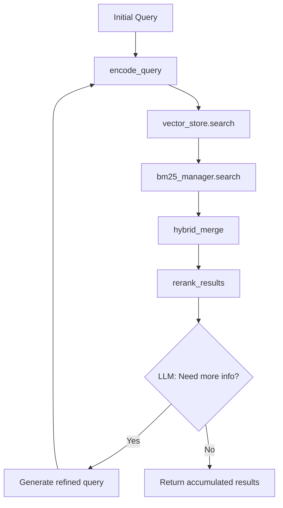

# Retrieval and Reranking

This document covers the retrieval and reranking components, including hybrid search, recursive retrieval, and result refinement strategies.

## Hybrid Search

### Overview

The retriever module (`core/retriever.py`) implements hybrid search combining:
- **Dense retrieval** (FAISS): Semantic similarity via embeddings
- **Sparse retrieval** (BM25): Exact keyword matching

This approach leverages the strengths of both methods: semantic understanding from vectors and precision from keyword matching.

### Hybrid Alpha Parameter

**Location**: `config.py` line 82

```python
HYBRID_ALPHA = 0.7  # 70% semantic + 30% keyword
```

**Effect**:
- `alpha = 0.7`: Final score = 0.7 × semantic_score + 0.3 × bm25_score
- Higher alpha: More weight on semantic similarity
- Lower alpha: More weight on keyword matching

## BM25 Index

### Overview

The BM25 index (`core/bm25_index.py`) provides keyword-based sparse retrieval using the BM25 (Best Matching 25) algorithm.

### BM25IndexManager Class

**Location**: `core/bm25_index.py` line 17

#### Key Design Decisions

1. **Chinese Tokenization**: Uses `jieba` for Chinese word segmentation
2. **Normalization**: Scores normalized against max score for merging with FAISS
3. **In-memory Only**: No persistence

#### Primary Methods

**`build_index()`** (lines 31-38):
```python
def build_index(self, documents: List[str], doc_ids: List[str]) -> bool:
    """
    Build BM25 index.
    
    Args:
        documents: Text documents
        doc_ids: Document identifiers
    
    Returns:
        True on success
    """
```

**Implementation**:
```python
# core/bm25_index.py lines 33-37
self.raw_corpus = documents
self.doc_mapping = {i: doc_id for i, doc_id in enumerate(doc_ids)}
self.tokenized_corpus = [list(jieba.cut(doc)) for doc in documents]
self.bm25_index = BM25Okapi(self.tokenized_corpus)
```

**`search()`** (lines 40-57):
```python
def search(self, query: str, top_k: int = 5) -> List[Dict]:
    """
    Search BM25 index for relevant documents.
    
    Args:
        query: Search query
        top_k: Number of results to return
    
    Returns:
        List of {'id': ..., 'score': ..., 'content': ...}
    """
```

**Implementation**:
```python
# core/bm25_index.py lines 45-57
tokenized_query = list(jieba.cut(query))
bm25_scores = self.bm25_index.get_scores(tokenized_query)
top_indices = np.argsort(bm25_scores)[-top_k:][::-1]

results = []
for idx in top_indices:
    if bm25_scores[idx] > 0:
        results.append({
            'id': self.doc_mapping[idx],
            'score': float(bm25_scores[idx]),
            'content': self.raw_corpus[idx]
        })
return results
```

**`clear()`** (lines 59-63):
```python
def clear(self):
    self.bm25_index = None
    self.doc_mapping = {}
    self.tokenized_corpus = []
    self.raw_corpus = []
```

### Module Singleton

```python
# core/bm25_index.py line 67
bm25_manager = BM25IndexManager()
```

## Hybrid Merge

### Overview

The `hybrid_merge()` function combines FAISS semantic results and BM25 keyword results using weighted scoring.

### Primary Symbol: `hybrid_merge()`

**Location**: `core/retriever.py` line 19

**Signature**:
```python
def hybrid_merge(
    semantic_results: Dict,
    bm25_results: List[Dict],
    alpha: float = None
) -> List[Tuple[str, Dict]]:
    """
    Merge semantic and BM25 search results.
    
    Args:
        semantic_results: {'ids': [[...]], 'documents': [[...]], 'metadatas': [[...]]}
        bm25_results: [{'id': ..., 'score': ..., 'content': ...}]
        alpha: Semantic search weight (default: HYBRID_ALPHA=0.7)
    
    Returns:
        Sorted list of (doc_id, {'score': ..., 'content': ..., 'metadata': ...})
    """
```

### Scoring Algorithm

**Semantic Score Normalization** (lines 46-50):
```python
num_results = len(semantic_results['documents'][0])
for i, (doc_id, doc, meta) in enumerate(...):
    score = 1.0 - (i / max(1, num_results))  # Rank-based normalization
    merged_dict[doc_id] = {'score': alpha * score, ...}
```

**BM25 Score Normalization** (lines 58-65):
```python
valid_scores = [r['score'] for r in bm25_results if 'score' in r]
max_bm25 = max(valid_scores) if valid_scores else 1.0

for result in bm25_results:
    norm_score = result['score'] / max_bm25 if max_bm25 > 0 else 0
    merged_dict[doc_id]['score'] += (1 - alpha) * norm_score
```

**Merging Logic**:
1. Documents appearing in both results get combined scores
2. Documents in only one result get that result's weighted score
3. Results sorted by combined score (descending)

### Example

```python
# Semantic results: doc-a (rank 0), doc-b (rank 1)
# BM25 results: doc-b (score 4.0), doc-c (score 2.0)
# alpha = 0.5

# Final scores:
# doc-a: 0.5 × 1.0 + 0 = 0.5
# doc-b: 0.5 × 0.5 + 0.5 × 1.0 = 0.75 (highest)
# doc-c: 0 + 0.5 × 0.5 = 0.25
```

## Recursive Retrieval

### Overview

The `recursive_retrieval()` function implements multi-iteration retrieval with LLM-based query optimization. This extends basic hybrid search by:

1. Performing initial hybrid search
2. Using LLM to determine if query refinement is needed
3. Iterating up to `MAX_RETRIEVAL_ITERATIONS` times
4. Accumulating context across iterations

### Configuration

**Location**: `config.py` line 85

```python
MAX_RETRIEVAL_ITERATIONS = 3  # Maximum recursive iterations
```

### Primary Symbol: `recursive_retrieval()`

**Location**: `core/retriever.py` line 79

**Signature**:
```python
def recursive_retrieval(
    initial_query: str,
    max_iterations: int = None,
    enable_web_search: bool = False,
    model_choice: str = "siliconflow"
) -> Tuple[List[str], List[str], List[Dict]]:
    """
    Recursive retrieval with query optimization.
    
    Flow: 1. hybrid search → 2. rerank → 3. LLM decides if query needs refinement
    
    Returns:
        (all_contexts, all_doc_ids, all_metadata)
    """
```

### Algorithm Flow



**Query Encoding**: `encode_query()` from `core/embeddings.py` converts the query to a vector for FAISS search.

### Implementation Details

**Iteration Loop** (lines 94-180):
```python
for i in range(max_iterations):
    logging.info(f"递归检索 {i + 1}/{max_iterations},当前 Query: {query}")
    
    # 1. Encode query for semantic search
    query_embedding = encode_query(query)
    
    # 2. Web search (optional)
    web_texts = []
    if enable_web_search and check_serpapi_key():
        web_texts = search_web(query)
    
    # 3. Hybrid search
    semantic_results = vector_store.search(query_embedding, k=RETRIEVAL_TOP_K)
    bm25_results = bm25_manager.search(query, top_k=RETRIEVAL_TOP_K)
    merged = hybrid_merge(semantic_results, bm25_results, alpha=HYBRID_ALPHA)
    
    # 4. Rerank
    reranked = rerank_results(query, docs, doc_ids, metadata_list, top_k=RERANK_TOP_K)
    
    # 5. Accumulate results
    for doc_id, data in reranked:
        all_contexts.append(data['content'])
        all_doc_ids.append(doc_id)
        all_metadata.append(data['metadata'])
    
    # 6. LLM decides if refinement needed
    should_continue, new_query = _should_continue_retrieval(query, reranked)
    if not should_continue:
        break
    query = new_query
```

**Query Refinement Decision** (lines 140-175):
```python
def _should_continue_retrieval(query, results):
    """Ask LLM if more retrieval is needed"""
    prompt = f"""Given the query and retrieved results, determine if more information is needed.
    
    Query: {query}
    Results: {results[:3]}  # Top 3 results
    
    Respond with:
    1. "NO_MORE_NEEDED" if results are sufficient
    2. "REFINE_QUERY: <new query>" if more retrieval needed
    """
    
    response = call_llm_simple(prompt, model_choice)
    if "NO_MORE_NEEDED" in response:
        return False, None
    elif "REFINE_QUERY:" in response:
        return True, response.split("REFINE_QUERY:")[1].strip()
    return False, None
```

## Reranking

### Overview

Reranking (`core/reranker.py`) refines retrieval results using a two-stage approach:

1. **Recall Stage**: Fast hybrid search returns top-K candidates
2. **Rerank Stage**: More precise model scores candidates for final ordering

### Rerank Methods

| Method | Configuration | Model | Speed | Precision |
|--------|---------------|-------|-------|-----------|
| `cross_encoder` | `RERANK_METHOD = "cross_encoder"` | distiluse-base-multilingual-cased-v2 | Medium | High |
| `llm` | `RERANK_METHOD = "llm"` | Configured LLM | Slow | Very High |

### CrossEncoder Reranking

#### Lazy Loading

```python
# core/reranker.py lines 18-37
_cross_encoder = None
_cross_encoder_lock = threading.Lock()

def get_cross_encoder():
    global _cross_encoder
    if _cross_encoder is None:
        with _cross_encoder_lock:
            if _cross_encoder is None:
                try:
                    from sentence_transformers import CrossEncoder
                    _cross_encoder = CrossEncoder(
                        'sentence-transformers/distiluse-base-multilingual-cased-v2'
                    )
                except Exception as e:
                    logging.error(f"加载交叉编码器失败：{str(e)}")
                    _cross_encoder = None
    return _cross_encoder
```

#### Scoring

```python
# core/reranker.py lines 40-61
def rerank_with_cross_encoder(query, docs, doc_ids, metadata_list, top_k=5):
    encoder = get_cross_encoder()
    cross_inputs = [[query, doc] for doc in docs]
    scores = encoder.predict(cross_inputs)
    
    results = [
        (doc_id, {'content': doc, 'metadata': meta, 'score': float(score)})
        for doc_id, doc, meta, score in zip(doc_ids, docs, metadata_list, scores)
    ]
    return sorted(results, key=lambda x: x[1]['score'], reverse=True)[:top_k]
```

### LLM-based Reranking

```python
# core/reranker.py lines 64-90
@lru_cache(maxsize=32)
def get_llm_relevance_score(query, doc):
    """Score query-document relevance using LLM"""
    prompt = f"""Given query and document, assess relevance (0-10).
    
    Query: {query}
    Document: {doc}
    Relevance score (0-10):"""
    
    response = get_session().post(
        "http://localhost:11434/api/generate",
        json={"model": OLLAMA_MODEL_NAME, "prompt": prompt, "stream": False},
        timeout=180
    )
    result = response.json().get("response", "").strip()
    return float(extracted_score)  # Parse 0-10 integer
```

### Unified Rerank Interface

```python
# core/reranker.py lines 105-115
def rerank_results(query, docs, doc_ids, metadata_list, method=None, top_k=5):
    if method is None:
        method = RERANK_METHOD
    
    if method == "llm":
        return rerank_with_llm(query, docs, doc_ids, metadata_list, top_k)
    elif method == "cross_encoder":
        return rerank_with_cross_encoder(query, docs, doc_ids, metadata_list, top_k)
    else:
        return _fallback_results(doc_ids, docs, metadata_list)
```

### Fallback Behavior

```python
# core/reranker.py lines 118-121
def _fallback_results(doc_ids, docs, metadata_list):
    """Fallback: return in original order"""
    return [(doc_id, {'content': doc, 'metadata': meta, 'score': 1.0 - idx / len(docs)})
            for idx, (doc_id, doc, meta) in enumerate(zip(doc_ids, docs, metadata_list))]
```

## Configuration

### Retrieval Parameters

| Parameter | Default | Location | Purpose |
|-----------|---------|----------|---------|
| `HYBRID_ALPHA` | 0.7 | `config.py` line 82 | Semantic vs keyword weight |
| `RETRIEVAL_TOP_K` | 10 | `config.py` line 83 | Initial retrieval candidates |
| `RERANK_TOP_K` | 5 | `config.py` line 84 | Final results after rerank |
| `MAX_RETRIEVAL_ITERATIONS` | 3 | `config.py` line 85 | Max recursive iterations |
| `RERANK_METHOD` | "cross_encoder" | `config.py` line 51 | Reranking algorithm |

## Focused Tests

**File**: `tests/test_retrieval.py`

### Test Cases

**`test_bm25_returns_relevant_document_first()`**:
```python
def test_bm25_returns_relevant_document_first():
    manager = BM25IndexManager()
    manager.build_index(
        ["FAISS supports dense vector retrieval",
         "BM25 supports exact keyword retrieval",
         "RAG combines retrieval with generation"],
        ["dense", "sparse", "rag"]
    )
    
    results = manager.search("BM25 keyword", top_k=2)
    
    assert results
    assert results[0]["id"] == "sparse"  # Keyword match ranks first
```

**`test_hybrid_merge_combines_semantic_and_sparse_scores()`**:
```python
def test_hybrid_merge_combines_semantic_and_sparse_scores():
    semantic = {
        "ids": [["doc-a", "doc-b"]],
        "documents": [["semantic result", "shared result"]],
        "metadatas": [[{"source": "a"}, {"source": "b"}]],
    }
    sparse = [
        {"id": "doc-b", "score": 4.0, "content": "shared result"},
        {"id": "doc-c", "score": 2.0, "content": "keyword result"},
    ]
    
    merged = hybrid_merge(semantic, sparse, alpha=0.5)
    merged_by_id = dict(merged)
    
    assert set(merged_by_id) == {"doc-a", "doc-b", "doc-c"}
    assert merged[0][0] == "doc-b"  # doc-b wins with combined score
    assert merged_by_id["doc-b"]["score"] > merged_by_id["doc-a"]["score"]
```

## Change Recipes

### Adjusting Hybrid Alpha

1. Modify `HYBRID_ALPHA` in `config.py`
2. Test with queries that have varying keyword/semantic needs
3. Higher values favor semantic matching, lower values favor exact keywords

### Switching Rerank Method

1. Modify `RERANK_METHOD` in `config.py`:
   ```python
   RERANK_METHOD = "llm"  # or "cross_encoder"
   ```
2. For LLM method, ensure LLM backend is configured
3. Note: LLM reranking is slower but more precise

### Adding Recursive Retrieval Logging

To debug recursive retrieval:

```python
# Add at start of recursive_retrieval()
logging.info(f"Starting recursive retrieval: {initial_query}")

# Add after each iteration
logging.info(f"Iteration {i+1}: Retrieved {len(reranked)} results")
logging.info(f"Iteration {i+1}: New query = {new_query}")
```

### Implementing Custom Reranker

1. Create new function in `core/reranker.py`:
   ```python
   def rerank_with_custom_model(query, docs, doc_ids, metadata_list, top_k=5):
       # Your custom reranking logic
       return results
   ```

2. Update `rerank_results()`:
   ```python
   elif method == "custom":
       return rerank_with_custom_model(...)
   ```

## Related Components

<!-- openwiki: broken internal link [/core/embeddings-and-vector-store.md] file "/core/embeddings-and-vector-store.md" does not exist. Fix the href or restore the target, then delete this comment. -->
- [Embeddings and Vector Store](/core/embeddings-and-vector-store.md) - FAISS dense retrieval
<!-- openwiki: broken internal link [/core/generation.md] file "/core/generation.md" does not exist. Fix the href or restore the target, then delete this comment. -->
- [Generation](/core/generation.md) - Using retrieved context for answer generation
<!-- openwiki: broken internal link [/configuration/environment-and-models.md] file "/configuration/environment-and-models.md" does not exist. Fix the href or restore the target, then delete this comment. -->
- [Configuration](/configuration/environment-and-models.md) - RAG hyperparameters
