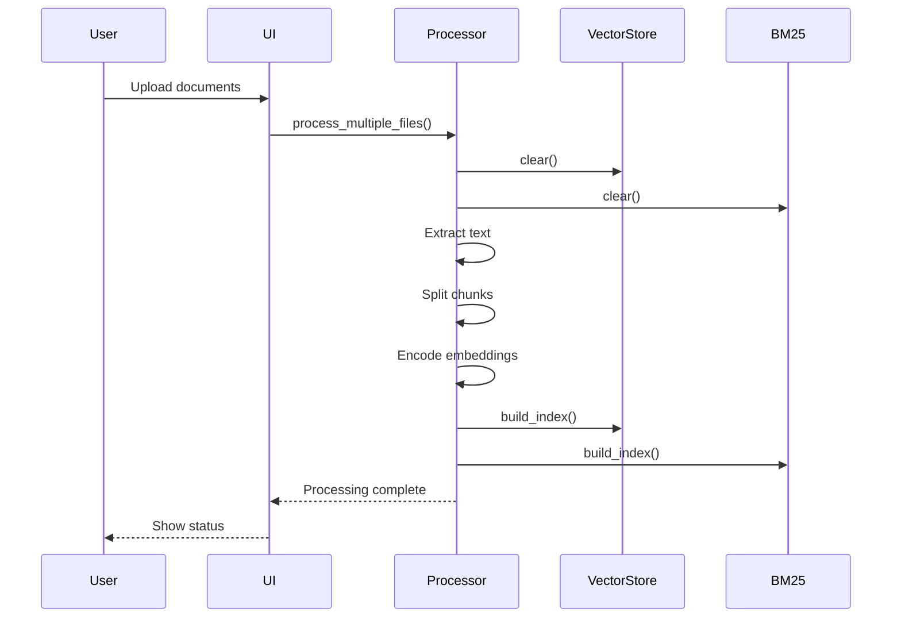

# Operations

This document covers running the application, deployment considerations, and troubleshooting.

## Running the Application

### Prerequisites

1. **Python 3.10+** installed
2. **Virtual environment** created and activated
3. **Dependencies** installed via `pip install -r requirements.txt`
4. **Configuration** in `.env` file (at least one model backend)

### Creating Environment

```bash
# Clone repository
git clone https://github.com/weiwill88/Local_Pdf_Chat_RAG.git
cd Local_Pdf_Chat_RAG

# Create virtual environment
python3.10 -m venv .venv

# Activate environment
# Windows:
.venv\Scripts\activate
# Linux/macOS:
source .venv/bin/activate

# Install dependencies
python -m pip install --upgrade pip
pip install -r requirements.txt
```

### Configuring Model Backend

```bash
# Copy example configuration
cp example.env .env

# Edit .env and add API keys
# At minimum, configure one of:
# - SILICONFLOW_API_KEY
# - MAGICK_API_KEY
# - Ollama running locally
```

### Starting Gradio Web UI

**Command**:
```bash
python rag_demo.py
```

**Output**:
```
Gradio version: 6.x.x
启动 Gradio Web UI 于 http://127.0.0.1:17995
```

**Port Selection**:
- Default: `17995`
- Fallback: `17996`, `17997`, `17998`, `17999`
- If all occupied: "所有可用端口都被占用"

**Access**: Open browser to `http://127.0.0.1:17995`

### Starting REST API

**Command**:
```bash
python api_router.py
```

**Output**:
```
INFO:api_router:API 服务启动
INFO:     Uvicorn running on http://127.0.0.1:17995
```

**Access**:
- Status: `GET http://127.0.0.1:17995/api/status`
- Upload: `POST http://127.0.0.1:17995/api/upload`
- Ask: `POST http://127.0.0.1:17995/api/ask`

## Data Lifecycle

### In-Memory State

**Important**: All index data is stored in memory only.

**Implications**:
- **No persistence**: Index data lost on application restart
- **Clear on upload**: New document upload clears existing index
- **No multi-session**: State not shared across sessions

### State Management

**Vector Store**:
```python
from core.vector_store import vector_store

# Check state
vector_store.is_ready          # True if index has data
vector_store.total_chunks      # Number of chunks in index

# Clear state
vector_store.clear()
```

**BM25 Index**:
```python
from core.bm25_index import bm25_manager

# Clear state
bm25_manager.clear()
```

### Processing Flow



## Deployment Considerations

### Current Limitations

| Limitation | Impact | Mitigation |
|------------|--------|------------|
| In-memory state | No persistence across restarts | Re-process documents after restart |
| Single instance | No horizontal scaling | Run single instance only |
| No authentication | Open access | Add auth layer in front |
| No tenant isolation | All users share state | Use separate instances per tenant |
| No rate limiting | Potential abuse | Add rate limiting proxy |

### Production Readiness

**Before production use, implement**:

1. **Authentication**: Add user authentication (e.g., OAuth, JWT)
2. **Persistence**: Implement disk-based index persistence
3. **Multi-tenancy**: Add tenant isolation
4. **Monitoring**: Add logging, metrics, alerting
5. **Rate Limiting**: Add request rate limiting
6. **HTTPS**: Enable TLS/SSL
7. **Security Audit**: Review security implications
8. **Evaluation**: Benchmark quality and performance

### Recommended Architecture

```
                    ┌─────────────────┐
                    │   Load Balancer │
                    └────────┬────────┘
                             │
        ┌────────────────────┼────────────────────┐
        │                    │                    │
        ▼                    ▼                    ▼
┌──────────────┐    ┌──────────────┐    ┌──────────────┐
│   Instance 1 │    │   Instance 2 │    │   Instance 3 │
│  (RAG App)   │    │  (RAG App)   │    │  (RAG App)   │
└──────┬───────┘    └──────┬───────┘    └──────┬───────┘
       │                   │                   │
       └───────────────────┼───────────────────┘
                           ▼
                  ┌─────────────────┐
                  │ Shared Storage  │
                  │  (Vector Index) │
                  └─────────────────┘
```

## Troubleshooting

### Common Issues

#### "所有可用端口都被占用"

**Cause**: Ports 17995-17999 all in use

**Solution**:
```bash
# Find process using port (Linux/macOS)
lsof -i :17995

# Find process using port (Windows)
netstat -ano | findstr :17995

# Kill process or use different port
```

#### "未配置 API Key"

**Cause**: No valid API key configured

**Solution**:
```bash
# Check .env file
cat .env

# Ensure at least one of:
# SILICONFLOW_API_KEY=sk-your-key
# MAGICK_API_KEY=sk-your-key
# Ollama running locally
```

#### "加载向量化模型失败"

**Cause**: Network issue downloading model from Hugging Face

**Solution**:
```bash
# Check HF_ENDPOINT in config.py
# Set to appropriate mirror:
os.environ['HF_ENDPOINT'] = 'https://hf-mirror.com'

# Or download model manually:
from sentence_transformers import SentenceTransformer
model = SentenceTransformer('all-MiniLM-L6-v2')
```

#### "加载交叉编码器失败"

**Cause**: CrossEncoder model download failed

**Solution**:
```bash
# Check network connection
# Model downloads from Hugging Face automatically
# Set HF_ENDPOINT mirror if needed
```

#### "FAISS 索引构建失败"

**Cause**: Insufficient memory or corrupted embeddings

**Solution**:
```bash
# Check available memory
# Reduce CHUNK_SIZE if memory constrained
# Verify embeddings are valid numpy arrays
```

#### "文档内容为空"

**Cause**: PDF has no text layer (scanned image)

**Solution**:
```bash
# Project does not support OCR
# Pre-process PDF with OCR tool before upload
# Or use text-based PDF
```

### Debug Mode

Enable detailed logging:

```python
# In rag_demo.py or api_router.py
import logging
logging.basicConfig(level=logging.DEBUG)
```

### Performance Issues

#### Slow Document Processing

**Causes**:
- Large documents
- Slow embedding model
- Network latency for model download

**Solutions**:
- Reduce document size
- Pre-download models
- Use smaller embedding model

#### Slow Response Time

**Causes**:
- Large chunk count
- Recursive retrieval iterations
- Slow LLM backend

**Solutions**:
- Reduce RETRIEVAL_TOP_K
- Reduce MAX_RETRIEVAL_ITERATIONS
- Use faster LLM model
- Enable rerank caching

### Resource Usage

#### Memory

```python
import psutil
memory = psutil.virtual_memory()
print(f"Memory usage: {memory.percent}%")
print(f"Available: {memory.available / 1024**3:.2f} GB")
```

#### CPU

```python
import psutil
cpu = psutil.cpu_percent(interval=1)
print(f"CPU usage: {cpu}%")
```

## Monitoring

### Application Logs

**Gradio UI**: Console output
```
Gradio version: 6.x.x
启动 Gradio Web UI 于 http://127.0.0.1:17995
```

**REST API**: Uvicorn logs
```
INFO:api_router:API 服务启动
INFO:     Uvicorn running on http://127.0.0.1:17995
```

### Custom Logging

```python
import logging

logger = logging.getLogger(__name__)
logger.info("Processing started")
logger.warning("Low memory")
logger.error("API call failed")
```

## Backup and Recovery

### Manual Backup

Since data is in-memory, no backup needed during operation.

**After document processing**:
- Note document count
- Note chunk count
- Re-upload documents after restart

### Recovery After Crash

1. Restart application
2. Re-upload documents
3. Index rebuilt automatically

## Related Components

<!-- openwiki: broken internal link [/configuration/environment-and-models.md] file "/configuration/environment-and-models.md" does not exist. Fix the href or restore the target, then delete this comment. -->
- [Configuration](/configuration/environment-and-models.md) - Environment setup
<!-- openwiki: broken internal link [/interfaces/gradio-ui.md] file "/interfaces/gradio-ui.md" does not exist. Fix the href or restore the target, then delete this comment. -->
- [Gradio Web UI](/interfaces/gradio-ui.md) - UI operations
<!-- openwiki: broken internal link [/interfaces/rest-api.md] file "/interfaces/rest-api.md" does not exist. Fix the href or restore the target, then delete this comment. -->
- [REST API](/interfaces/rest-api.md) - API operations
<!-- openwiki: broken internal link [/testing/overview.md] file "/testing/overview.md" does not exist. Fix the href or restore the target, then delete this comment. -->
- [Testing](/testing/overview.md) - Validation
