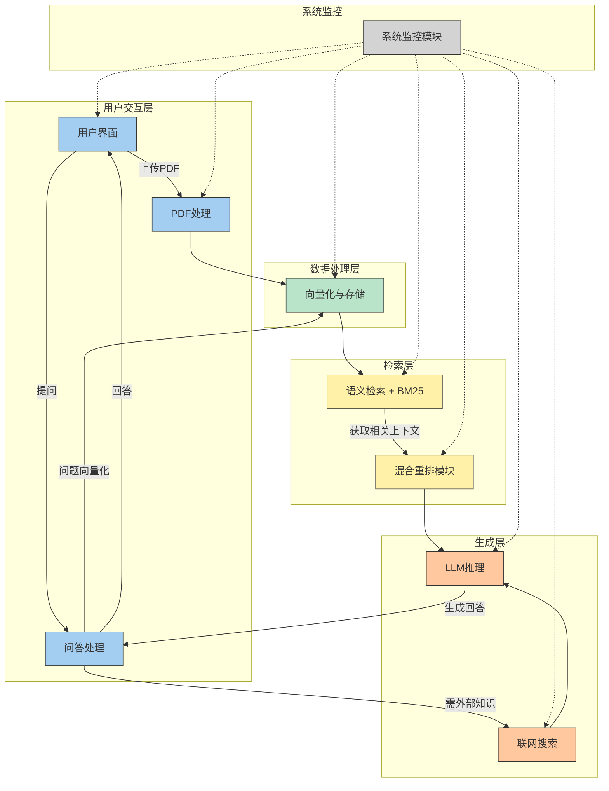

<div align="center">
<h1>📚 本地化智能问答系统 (FAISS版)</h1>
<p>


</p>

</div>

## 🎯 核心学习目标

本项目旨在为希望深入理解RAG（Retrieval-Augmented Generation，检索增强生成）技术原理的开发者提供一个可动手实践的学习平台。
*   **拆解RAG黑盒**：亲手实现从文档加载、文本切分、向量化、检索到生成的完整链路，理解每个组件的内部工作机制
*   **掌握关键技术选型**：体验FAISS向量检索与BM25关键词检索的混合策略，了解不同索引结构的适用场景
*   **实践性能优化技巧**：过交叉编码器重排序、递归检索等高级功能，学习提升RAG系统准确性的实用方法
*   **构建多模型适配能力**：集成本地Ollama与云端API，掌握不同LLM引擎的对接和调优策略

掌握这些基础后，能更有的放矢地使用高级RAG框架的API进行针对性调优或定制开发。

## 🌟 核心功能

*   📁 **文档处理**：支持上传并处理多种类型的文档（.pdf, .txt, .docx, .md, .html, .csv, .xls, .xlsx），自动分割和向量化。
*   🔍 **混合检索**：结合FAISS进行语义检索和BM25进行关键词检索，提高检索召回率和准确性。
*   🔄 **结果重排序**：支持交叉编码器（CrossEncoder）和LLM对检索结果进行重排序，优化相关性。
*   🌐 **联网搜索增强 (可选)**：通过SerpAPI获取实时网络信息，增强回答的时效性（需配置API密钥）。
*   🗣️ **本地/云端**：可选择使用本地Ollama大模型（如DeepSeek-R1系列）或云端SiliconFlow API进行推理。
*   🖥️ **用户友好界面**：基于Gradio构建交互式Web界面，支持多种主题界面。
*   📊 **分块可视化**：在UI上展示文档分块情况，帮助理解数据处理过程。
*   🛡️  **系统监控**：监控数据（日志、指标、追踪）的采集，并进行相应的可视化。
## 🔧 系统架构



## 🚀 使用方法

### 环境准备

1.  **创建并激活虚拟环境** (推荐使用Python 3.9+):
    ```bash
    # 创建名为 rag_env 的 Conda 环境，指定 Python 版本（例如 3.10）
    conda create -n rag_env python=3.10 -y
    
    # 激活环境
    conda activate rag_env
    ```
2.  **安装依赖项**:
    ```bash
    pip install -r requirements.txt
    ```
3.  **安装并启动Ollama服务** (如果希望使用本地大模型):
    *   访问 [https://ollama.com/download](https://ollama.com/download) 下载并安装Ollama。
    *   启动Ollama服务: `ollama serve`
    *   拉取所需模型，例如: `ollama pull deepseek-r1:8b`。本项目默认尝试使用`deepseek-r1:8b`和`DeepSeek-R1-Distill-Qwen-7B`。
4.  **配置API密钥 (可选)**:
    在项目根目录创建 `.env` 文件，并按需添加以下内容：
    ```env
    # 用于联网搜索
    SERPAPI_KEY=您的SERPAPI密钥

    # 用于SiliconFlow云端大模型
    SILICONFLOW_API_KEY=您的SiliconFlow API密钥
    # SILICONFLOW_API_URL=https://api.siliconflow.cn/v1/chat/completions (不需要修改)
    ```

### 启动服务

```bash
python rag_demo.py
```
服务启动后，通常会自动在浏览器中打开 `http://127.0.0.1:17995` (或自动选择的其他可用端口)。

## 📦 核心依赖（按功能层分类）

### 用户交互层
* gradio: 快速搭建交互式 Web 界面，支持文件上传和问题输入。  
* webbrowser: 自动在浏览器中打开 Web 界面。  

### 数据处理层
* pdfminer.six: 从 PDF 文件中提取文本内容，支持多种编码和中文。  
* langchain-text-splitters: 将长文本切分为适合向量化或检索的片段。  
* sentence-transformers: 提供文本向量化（SentenceTransformer）和语义重排序（CrossEncoder）模型。  
* faiss-cpu: 高效向量检索库（IndexFlatL2、IndexIVFFlat、IndexIVFPQ），用于向量索引和搜索。  
* numpy: 数值计算库，支持 FAISS 向量运算和矩阵处理。  
* jieba: 中文分词，用于 BM25 索引和文本处理。  
* rank_bm25: 实现 BM25 关键词检索算法，用于稀疏文本检索。  

### 检索与外部调用
* requests, urllib3: 发起 HTTP 请求并支持重试机制，用于调用外部 API（如 SerpAPI、Ollama 等）。  
* json: 处理 JSON 数据，用于 API 请求与响应解析。  

### 系统与辅助工具
* os: 提供操作系统接口，用于环境变量、路径和文件管理。  
* pathlib: 现代化文件路径处理，跨平台兼容。  
* threading: 多线程处理，提高文档向量化和检索效率。  
* functools.lru_cache: 缓存函数调用结果，提高重复调用性能。  
* typing: 类型注解工具，提高代码可读性和可维护性。  
* logging: 记录程序运行状态、调试信息和错误日志。  
* time, datetime: 时间处理与延迟控制，获取时间戳和格式化日期时间。  
* re: 正则表达式处理，用于文本清洗和模式匹配。  
* socket: 本地网络检测和端口占用检查。  
* io: 内存数据流处理，例如将 PDF 文本写入内存对象。  
* python-dotenv: 加载环境变量配置文件（如 API Key）。  

### 可选 API 服务
* fastapi, uvicorn, python-multipart: 如果希望提供独立 API 服务。  

## 💡 进阶与扩展方向

本项目作为一个入门级的RAG实现，为后续的迭代和功能扩展提供了良好的基础。以下是一些可以考虑的进阶方向：

1.  **多跳检索与推理链支持**
    *   **解释**：使系统能够处理需要多次检索-推理循环的复杂问题。系统能自动将复杂问题分解为子问题，通过迭代检索不同片段并逐步推理，最终整合信息得到答案。
    *   **难度**：困难。

2.  **混合检索与多模态适配**
    *   **解释**：超越纯文本检索，集成密集向量检索和稀疏词汇检索的混合方案。并探索适配图像、表格等多模态内容的检索与理解能力，提升对复杂文档的信息利用效率。
    *   **难度**：中等至困难。

3.  **检索器的自我批判与优化循环**
    *   **解释**：引入基于LLM的"自我批判"机制，让系统能评估当前检索结果的质量。若结果不佳，可自动触发新的查询改写或检索策略，形成一个检索-评估-优化的自我改进闭环。
    *   **难度**：困难。

4.  **基于用户反馈的持续学习**
    *   **解释**：设计机制收集并利用用户的显性反馈（如点赞/点踩）和隐性反馈（如交互深度），动态调整检索权重或嵌入模型，使系统能随使用持续优化，更贴合用户需求。
    *   **难度**：困难。

5.  **缓存与索引的智能更新策略**
    *   **解释**：当知识库增删文档时，实现高效的增量索引更新。同时，为常见查询或高价值检索结果设计智能缓存层，显著降低响应延迟和计算开销。
    *   **难度**：中等。

欢迎大家基于此项目进行探索和贡献！

## 📝 许可证

本项目采用MIT许可证。


