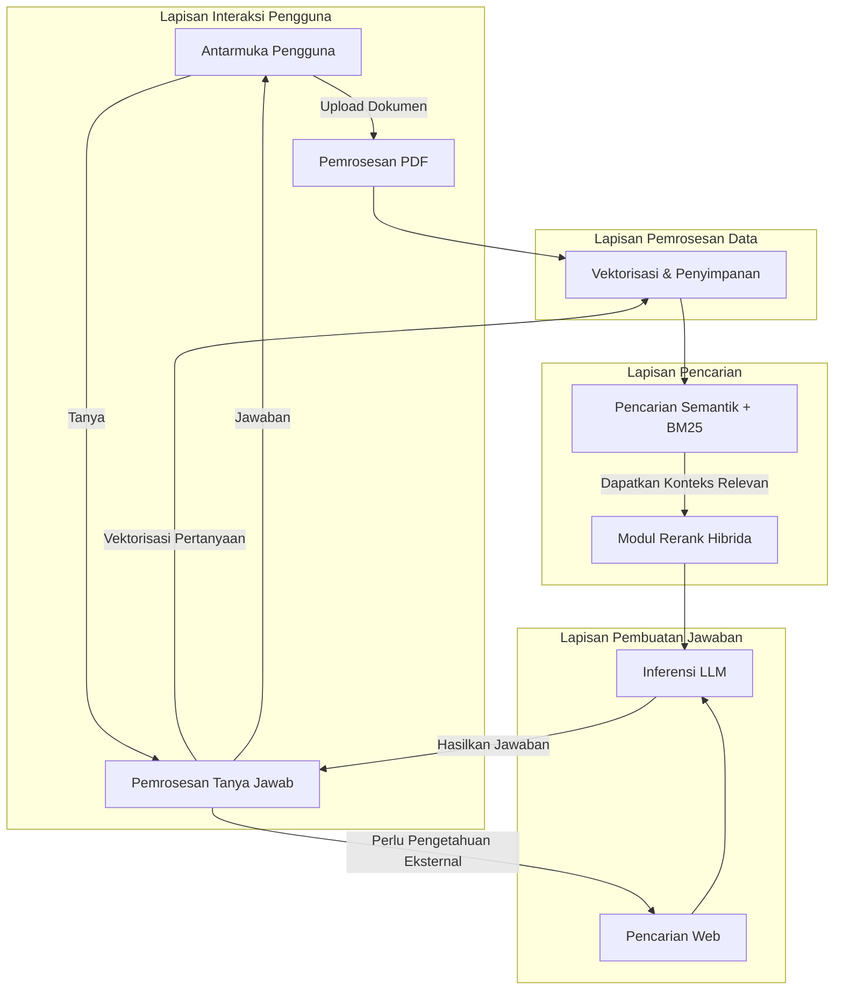

<div align="center">
<h1>📚 Sistem Tanya Jawab Cerdas Lokal (Versi FAISS)</h1>
<p>


</p>
</div>

## 🎯 Tujuan Pembelajaran Utama

Proyek ini bertujuan untuk menyediakan platform pembelajaran praktis bagi pengembang yang ingin memahami secara mendalam prinsip-prinsip teknis RAG (Retrieval-Augmented Generation, pencarian yang disempurnakan untuk pembuatan).

*   **Membongkar Kotak Hitam RAG**: Mengimplementasikan sendiri seluruh alur kerja mulai dari pemuatan dokumen, pemecahan teks, vektorisasi, pencarian, hingga pembuatan jawaban.
*   **Menguasai Pemilihan Teknologi Kunci**: Mengalami strategi hibrida dari pencarian vektor FAISS dan pencarian kata kunci BM25.
*   **Mempraktikkan Teknik Optimasi Performa**: Mempelajari cara meningkatkan akurasi sistem RAG melalui fitur canggih seperti pengurutan ulang Cross-Encoder dan pencarian rekursif.
*   **Membangun Kemampuan Adaptasi Multi-Model**: Mengintegrasikan Ollama lokal dan API SiliconFlow cloud, menguasai strategi integrasi mesin LLM yang berbeda.

## 🌟 Fitur Utama

*   📁 **Pemprosesan Dokumen**: Mendukung pengunggahan dan pemrosesan berbagai jenis dokumen (.pdf, .txt, .docx, .md, .html, .csv, .xls, .xlsx), pemisahan otomatis, dan vektorisasi.
*   🔍 **Pencarian Hibrida**: Pencarian semantik FAISS + Pencarian kata kunci BM25, meningkatkan tingkat recall dan akurasi pencarian.
*   🔄 **Pengurutan Ulang Hasil**: Mendukung Cross-Encoder dan LLM untuk mengurutkan ulang hasil pencarian.
*   🌐 **Penyempurnaan Pencarian Web (Opsional)**: Memperoleh informasi web waktu nyata melalui SerpAPI (memerlukan konfigurasi kunci API).
*   🗣️ **Lokal/Cloud**: Dapat memilih menggunakan model besar Ollama lokal atau API SiliconFlow cloud untuk inferensi.
*   🤖 **Fallback Cerdas**: Mendeteksi backend LLM yang tersedia secara otomatis saat memulai, memprioritaskan layanan yang telah dikonfigurasi.
*   🖥️ **Antarmuka Ramah Pengguna**: Antarmuka Web interaktif yang dibangun menggunakan Gradio.
*   📊 **Visualisasi Pemecahan Teks**: Menampilkan situasi pemecahan teks dokumen pada UI untuk membantu memahami proses pengolahan data.

## 📂 Struktur Proyek (Jalur Pembelajaran)

Proyek ini dibagi menjadi modul-modul independen berdasarkan **Alur Kerja RAG**, disarankan untuk mempelajari modul demi modul sesuai dengan urutan berikut:

```
├── config.py                 # ⚙️ Konfigurasi Pusat (Variabel lingkungan, hyperparameter, deteksi otomatis LLM)
├── rag_demo.py               # 🖥️ Entri Utama (Gradio UI + Peluncuran)
├── api_router.py             # 🔌 REST API Router
│
├── core/                     # 🧠 Modul Inti RAG (Disarankan dipelajari berurutan berdasarkan alur kerja)
│   ├── document_loader.py    # 1️⃣ Pemuat Dokumen — Ekstraksi teks multi-format
│   ├── text_splitter.py      # 2️⃣ Pembagi Teks — Strategi pemecahan teks panjang
│   ├── embeddings.py         # 3️⃣ Vektorisasi — Pemetaan Teks → Vektor
│   ├── vector_store.py       # 4️⃣ Penyimpanan Vektor — Indeks FAISS (Pilihan adaptif)
│   ├── bm25_index.py         # 5️⃣ Pencarian Jarang (Sparse Retrieval) — Pencarian kata kunci BM25
│   ├── retriever.py          # 6️⃣ Pencarian Hibrida — Gabungan Semantik + Kata Kunci + Pencarian Rekursif
│   ├── reranker.py           # 7️⃣ Pengurutan Ulang (Rerank) — Pengurutan halus Cross-Encoder/LLM
│   └── generator.py          # 8️⃣ Jawaban Generator — Konstruksi Prompt + Panggilan LLM
│
├── features/                 # ✨ Fitur Tambahan
│   ├── web_search.py         # Pencarian Web (SerpAPI)
│   ├── conflict_detector.py  # Deteksi Konflik
│   └── thinking_chain.py     # Pemrosesan Chain of Thought (DeepSeek-R1)
│
└── utils/                    # 🔧 Modul Utilitas
    └── network.py            # HTTP Session + Deteksi Port
```

## 🔧 Arsitektur Sistem


```mermaid
graph TD
    subgraph "Lapisan Interaksi Pengguna"
        A[Antarmuka Pengguna] --> |Upload Dokumen| B[Pemrosesan PDF]
        A --> |Tanya| C[Pemrosesan Tanya Jawab]
    end

    subgraph "Lapisan Pemrosesan Data"
        B --> D[Vektorisasi & Penyimpanan]
        C --> |Vektorisasi Pertanyaan| D
    end

    subgraph "Lapisan Pencarian"
        D --> E[Pencarian Semantik + BM25]
        E --> |Dapatkan Konteks Relevan| F[Modul Rerank Hibrida]
    end

    subgraph "Lapisan Pembuatan Jawaban"
        C --> |Perlu Pengetahuan Eksternal| G[Pencarian Web]
        F --> H[Inferensi LLM]
        G --> H
        H --> |Hasilkan Jawaban| C
    end

    C --> |Jawaban| A
```

## 🚀 Cara Penggunaan

### Persiapan Lingkungan

1.  **Membuat dan Mengaktifkan Lingkungan Virtual** (Direkomendasikan Python 3.9+):

    **Metode 1: Menggunakan venv (Direkomendasikan)**

    Mac / Linux:
    ```bash
    python3 -m venv rag_env
    source rag_env/bin/activate
    ```

    Windows:
    ```bash
    python -m venv rag_env
    rag_env\Scripts\activate
    ```

    **Metode 2: Menggunakan Conda (Opsional)**
    ```bash
    conda create -n rag_env python=3.10 -y
    conda activate rag_env
    ```

2.  **Menginstal Dependensi**:
    ```bash
    pip install -r requirements.txt
    ```

3.  **Mengonfigurasi Variabel Lingkungan**:
    ```bash
    # Salin contoh file konfigurasi
    cp example.env .env

    # Edit .env dan masukkan API Key Anda
    # Konfigurasikan setidaknya salah satu dari berikut:
    # - SILICONFLOW_API_KEY: Model besar cloud (Direkomendasikan, tidak memerlukan GPU lokal)
    # - Layanan Ollama dimulai secara lokal (perlu mengunduh model)
    ```

4.  **Menginstal dan Memulai Layanan Ollama** (Opsional, jika ingin menggunakan model besar lokal):
    *   Kunjungi [https://ollama.com/download](https://ollama.com/download) untuk mengunduh dan menginstal Ollama.
    *   Mulai layanan Ollama: `ollama serve`
    *   Tarik model yang diperlukan: `ollama pull deepseek-r1:8b`

### Deteksi Otomatis Backend LLM

Sistem akan mendeteksi backend LLM yang tersedia secara otomatis saat memulai:

| Prioritas | Kondisi | Tindakan |
|-----------|---------|----------|
| 1 | `.env` memiliki konfigurasi `SILICONFLOW_API_KEY` | Secara default menggunakan API SiliconFlow cloud |
| 2 | Layanan Ollama lokal tersedia | Secara default menggunakan model Ollama lokal |
| 3 | Keduanya tidak tersedia | Meminta pengguna untuk mengonfigurasinya |

> Di UI, Anda dapat beralih model secara manual kapan saja melalui menu tarik-turun.

### Memulai Layanan

```bash
python rag_demo.py
```

Setelah layanan dimulai, secara otomatis akan membuka `http://127.0.0.1:17995` di browser.

> ⏰ Model vektorisasi akan diunduh secara otomatis saat dijalankan pertama kali (sekitar 80MB), mohon bersabar.

## 📦 Dependensi Utama (Berdasarkan Lapisan Fungsional)

### Lapisan Interaksi Pengguna
* gradio: Membangun antarmuka Web interaktif dengan cepat

### Lapisan Pemrosesan Data
* pdfminer.six: Ekstraksi teks PDF
* langchain-text-splitters: Alat pemisah segmen teks
* sentence-transformers: Vektorisasi teks + Pengurutan ulang semantik
* faiss-cpu: Pustaka pencarian vektor yang efisien
* jieba: Pemecahan kata Bahasa Mandarin
* rank_bm25: Pencarian kata kunci BM25

### Pencarian dan Panggilan Eksternal
* requests, urllib3: Permintaan HTTP dan mekanisme coba ulang

### Sistem dan Alat Bantu
* python-dotenv: Manajemen variabel lingkungan
* psutil: Pemantauan sumber daya sistem
* numpy: Perhitungan vektor

### Layanan API Opsional
* fastapi, uvicorn: Layanan REST API independen

## 💡 Arah Tingkat Lanjut & Ekstensi

1.  **Dukungan Pencarian Multi-Langkah & Chain of Reasoning** — Menangani pertanyaan rumit yang memerlukan siklus pencarian-penalaran berulang (Sulit)
2.  **Pencarian Hibrida & Adaptasi Multi-Modal** — Mengintegrasikan pencarian konten multi-modal seperti gambar, tabel, dll. (Sedang hingga Sulit)
3.  **Evaluasi Mandiri & Siklus Optimasi Pencari** — LLM mengevaluasi kualitas pencarian dan secara otomatis meningkatkannya (Sulit)
4.  **Pembelajaran Berkelanjutan Berdasarkan Umpan Balik Pengguna** — Penyesuaian dinamis menggunakan umpan balik pengguna (Sulit)
5.  **Strategi Pembaruan Cerdas untuk Cache & Indeks** — Pembaruan indeks inkremental + lapisan cache cerdas (Sedang)

Selamat datang semua untuk menjelajah dan berkontribusi berdasarkan proyek ini!

---

## 📖 Ingin Belajar Lebih Sistematis?

Halo semua, saya **Wei Dongdong**, penulis proyek sumber terbuka ini.

Proyek ini adalah kerangka kerja pembelajaran yang saya rancang khusus untuk pemula RAG guna membantu semua orang memahami logika pemrosesan inti RAG dari awal. Jika Anda ingin menguasai RAG secara lebih sistematis dan menerapkan aplikasi model besar perusahaan dalam praktik, saya merekomendasikan tiga konten berikut yang memiliki **hubungan progresif**:

### 📘 Langkah 1: Bangun Fondasi — Membaca 《RAG落地之道》

Buku ini ditulis berdasarkan pengalaman praktis saya di garis depan, memandu Anda menguasai seluruh tumpukan teknologi secara bertahap, mulai dari pengembangan native hingga integrasi kerangka kerja, platform sumber terbuka, hingga sistem tingkat perusahaan. Buku ini menyediakan kode sumber lengkap yang dapat dijalankan dan mencakup berbagai tingkat teknis. **Jika Anda seorang pemula, memulai dari sini adalah yang paling tepat**.

<div align="center">

<p><strong>《RAG落地之道：从工作流到企业级Agent》</strong><br>Wei Dongdong | Publishing House of Electronics Industry</p>
</div>

### 🎬 Langkah 2: Praktik Kasus — Kursus Video

Setelah Anda memiliki fondasi tertentu dan pengalaman praktis, Anda dapat mempelajari lebih dalam **metodologi penerapan skenario perusahaan nyata** melalui rangkaian kursus video ini. Kursus ini mencakup **15 kasus implementasi aplikasi model besar perusahaan**, dari pengantar, pembongkaran konsep, hingga penerapan kasus, yang berkembang dalam tiga tingkat, membantu Anda bertransisi dari "bisa menjalankan Demo" menjadi "bisa menyerahkan proyek".

<div align="center">

<p><strong>Implementasi Aplikasi Model Besar Perusahaan · Dari Pemula hingga Lanjutan</strong><br>20+ Pengiriman Proyek | 10+5 Kasus | Toolkit Implementasi</p>
</div>

### 🌟 Langkah 3: Kemajuan Berkelanjutan — Bergabung dengan Komunitas Diskusi

Jika Anda sudah bekerja di garis depan dalam implementasi aplikasi model besar dan ingin bertukar pengalaman praktis dengan rekan sejawat serta mendapatkan kasus dan metodologi terbaru, selamat datang untuk bergabung dengan komunitas Knowledge Planet saya. **300+ praktisi model besar perusahaan** berbagi pengalaman langsung di sini, terus diperbarui.

<div align="center">

<p><strong>Aplikasi Model Besar Perusahaan dari Pemula hingga Implementasi</strong><br>300+ Anggota | 340+ Konten | Terus Diperbarui</p>
</div>

---

## 📝 Lisensi

Proyek ini menggunakan lisensi MIT.
